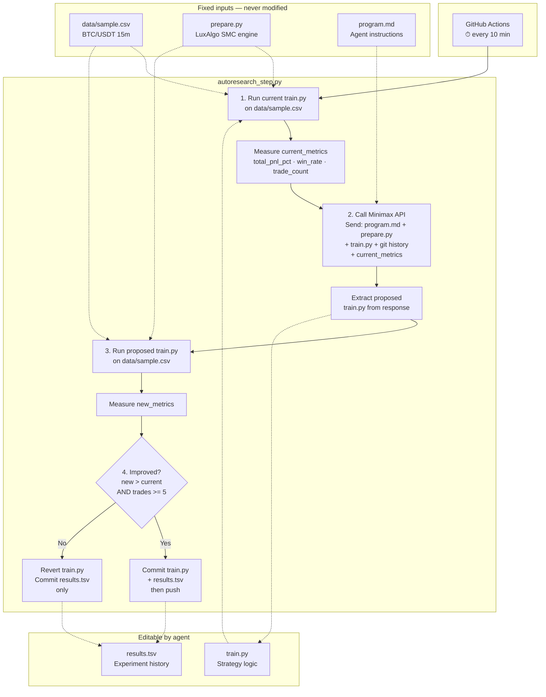

# autoresearch

*Inspired by [@karpathy's autoresearch](https://github.com/karpathy/autoresearch) — an autonomous LLM pretraining research loop — adapted for autonomous trading strategy research on LuxAlgo Smart Money Concepts.*

The idea: give an AI agent a trading strategy backtester and let it experiment autonomously. It modifies the strategy code, runs the backtest, checks if `total_pnl_pct` improved, keeps or discards, and repeats. You wake up in the morning to a log of experiments and (hopefully) a better strategy. The core philosophy is the same as Karpathy's — you're not touching `train.py` like you normally would as a researcher. Instead, you let the agent iterate on it while `prepare.py` provides the fixed evaluation harness.

## Pipeline

```mermaid
flowchart TD
    subgraph prepare_py ["prepare.py — Fixed Support Layer"]
        direction TB

        csv_in["OHLC CSV\ninput"]

        csv_in --> validate

        validate["Validate columns\nClean types"]

        validate --> indicators

        indicators["Compute RSI\nCompute ATR"]

        indicators --> vol

        vol["Volatility parsing\nHigh-vol bar detection"]

        vol --> legs

        legs["Compute leg series\nSwing · Internal · Equal"]

        legs --> pivots

        pivots["Detect pivots\nSwing highs/lows\nInternal highs/lows"]

        pivots --> structure

        structure["Process structure\nCHoCH / BoS"]

        structure --> ob

        ob["Order Block\ncreation + mitigation"]

        ob --> zones

        zones["Premium · Equilibrium\nDiscount zones"]

        zones --> fvg

        fvg["FVG detection\nEqual H/L"]

        fvg --> weak

        weak["Weak High / Low\nclassification"]

        weak --> frame

        frame["Strategy frame\nAll features per bar"]
    end

    subgraph train_py ["train.py — Editable Strategy"]
        direction TB

        signals["Signal detection\nLong / Short"]

        signals --> entry

        entry["Entry conditions\nOB overlap + RSI\n+ Weak High/Low"]

        entry --> exit_cond

        exit_cond["Exit conditions\nTP at +/- 2%\nor OB boundary break"]

        exit_cond --> trades

        trades["Trade list\nPnL calculation"]

        trades --> metrics

        metrics["total_pnl_pct\nwin_rate\ntrade_count"]
    end

    frame --> signals
```





## How it works

The repo has a clean separation of concerns:

- **`prepare.py`** — fixed support layer. Loads OHLC CSV, computes all LuxAlgo Smart Money Concepts context (order blocks, swing/internal pivots, FVGs, premium/discount zones, RSI, ATR, equal highs/lows), and runs `train.py` via `run_train_on_prepared_frame`. Not modified.
- **`train.py`** — the single file the agent edits. Contains entry/exit logic, RSI thresholds, take-profit percentage, position management. Everything is fair game. **This file is edited and iterated on by the agent.**
- **`program.md`** — instructions that tell the AI what the metric is, what it can change, and how the experiment loop works. **This file is edited and iterated on by the human.**
- **`autoresearch_step.py`** — orchestrator that runs one experiment iteration: measure current strategy, call Minimax for an improvement, test it, keep or revert. Not modified.

The metric is **`total_pnl_pct`** (sum of trade PnL percentages) — higher is better. Trade count must stay above 5 to prevent overfitting to a handful of lucky trades.

## Quick start

**Requirements:** Python 3.10+, a Minimax API key.

```bash
# 1. Install dependencies
pip install numpy pandas requests

# 2. Run the pipeline manually (one experiment iteration)
export MINIMAX_API_KEY=your_key_here
python autoresearch_step.py

# 3. Or just run the backtest without the AI loop
python prepare.py --csv data/sample.csv --run-train
```

## Running autonomously via GitHub Actions

The workflow (`.github/workflows/autoresearch.yml`) triggers every 10 minutes:

1. Add your `MINIMAX_API_KEY` as a repository secret in GitHub Settings.
2. Push to the branch you want the agent to iterate on.
3. The workflow runs `autoresearch_step.py`, which calls Minimax, tests the proposed change, and commits if improved.

With 10-minute cycles, that's ~6 experiments/hour and ~48+ experiments overnight.

## Project structure

```
prepare.py              — SMC feature engine + evaluation harness (do not modify)
train.py                — strategy logic (agent modifies this)
program.md              — agent instructions (human modifies this)
autoresearch_step.py    — experiment orchestrator (do not modify)
data/sample.csv         — BTC/USDT 15m OHLCV dataset (do not modify)
data/merge.py           — utility to merge Binance daily CSVs
results.tsv             — persistent experiment log (committed by agent)
.github/workflows/      — GitHub Actions workflow (10-min cron)
pyproject.toml          — dependencies (numpy, pandas, requests)
```

## Design choices

- **Single file to modify.** The agent only touches `train.py`. This keeps the scope manageable and diffs reviewable.
- **Fixed dataset.** The strategy always runs against the same `data/sample.csv`. This makes experiments directly comparable regardless of what the agent changes.
- **Git as state.** The commit history is the experiment log. Each "keep" commit advances `train.py`, each "discard" commit only updates `results.tsv`. You can `git log --oneline` to see the full research trajectory.
- **Self-contained.** No GPU required, no heavy dependencies. One dataset, one file, one metric.

## Acknowledgements

- [@karpathy/autoresearch](https://github.com/karpathy/autoresearch) — the original autonomous LLM pretraining research loop that inspired this project.
- [LuxAlgo Smart Money Concepts](https://www.tradingview.com/script/cR52pOF2/) — the TradingView indicator whose logic `prepare.py` translates into Python.

## License

MIT
